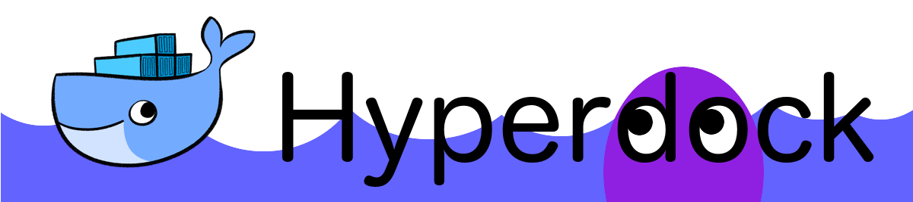
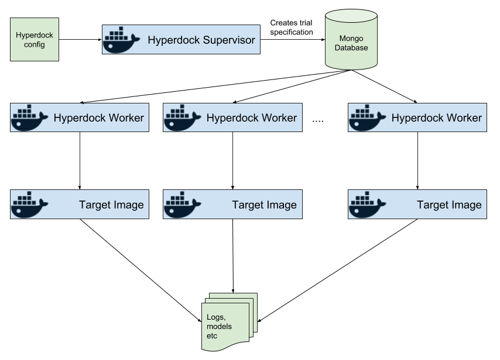

# Hyperdock


[](https://pypi.org/project/hyperdock/)
[](https://hub.docker.com/r/erikgartner/hyperdock-supervisor/)
[](https://travis-ci.org/ErikGartner/hyperdock)
[](https://codecov.io/gh/ErikGartner/hyperdock)
[](https://codeclimate.com/github/ErikGartner/hyperdock/)

*A simple framework for distributed hyperparameter optimization in Docker.*

## What is Hyperdock?

Hyperdock is a framework for hyperparameter search that can be used to optimized any target as long as that target can be run in a Docker container. That means that the target can be written in any language, use any framework or run on any operating system as long as it can be made into a Docker image.

The figure below shows the Hyperdock system and its main components.


The *Hyperdock Web UI* is the main interface for the end-users from where they can specify *trials* (a *target Docker image* and the hyperparameter space to search over). All trials, their status and results are stored in a *Mongo database*.

The *Hyperdock Supervisor* is a background process that monitors all trials. It determines what *jobs* (a specific hyperparameter combination) need to scheduled, which jobs have failed and should be restarted, and notifies users of results.

The *Hyperdock Workers* dequeues jobs from the *work queue* and then evaluates the *target image* with these parameters. They continually send status updates to the database to notify the user of progress.

The entire Hyperdock system can be distributed, i.e. Supervisor, Workers and WebUI need not run on the same host. They only need to be able to access the same Mongo database and the workers need to have access to any data required by the target image.

Each program that should be optimized needs to have its own Docker image, the *target image*, that is setup to load the parameters and write progress reports. Parameters are available in the json file `/hyperdock/params.json`. Once the target image has evaluated the parameters it simply writes the loss to the file `/hyperdock/loss.json` with the option of storing important files to `/hyperdock/out`. Logs from the target image are periodically tailed from the workers to the WebUI. More about how to write a target image can found below.

### How does Hyperdock work?

Hyperdock currently only implements grid search of the parameter space but future release may contain other methods such as sampling from distributions over the parameters.

## Setting up Hyperdock

You can either use the pre-built Docker images for Hyperdock or run the sub-systems directly on the host(s).

### Supervisor
To start the Hyperdock Supervisor using the Docker image run the following command:
```bash
docker run -it \
           --rm \
           --name hyperdock-supervisor \
           --link hyperdock-mongo \
           erikgartner/hyperdock-supervisor:latest \
           --mongodb mongodb://hyperdock-mongo:27017/hyperdock
```

Or run it on your host with Python >= 3.6 and install with pip:
```bash
pip install hyperdock
hyperdock-supervisor --mongodb mongodb://localhost:27017/hyperdock
```

#### Options
- `--mongo mongodb://localhost:27017/hyperdock` URL to the Mongo database

For full arguments to the supervisor run: `hyperdock-supervisor --help`.

### Worker
To start the Hyperdock Worker using the Docker image run the following command:
```bash
docker run -it \
           --rm \
           -v /var/run/docker.sock:/var/run/docker.sock \
           --link hyperdock-mongo \
           -v $(pwd):$(pwd) \
           erikgartner/hyperdock-worker:latest \
           --mongodb mongodb://hyperdock-mongo:27017/hyperdock
```

Or run it on your host with Python >= 3.6 and install with pip:
```bash
pip install hyperdock
hyperdock-worker --mongodb mongodb://localhost:27017/hyperdock
```

#### Options

- `-v $(pwd):$(pwd)` mirrors the path structure from the host in to  the Docker container. This is needed since the paths must be the the same when the worker starts the Target Image and mounts the data and results folders.
- `-v /var/run/docker.sock:/var/run/docker.sock` gives the Docker image access to control the outer Docker daemon. This is crucial for worker to start new containers

Or run it on your host with Python 3.6 and install with pip:
```bash
pip install hyperdock
hyperdock-worker --mongodb mongodb://localhost:27017/hyperdock
```

For full arguments to the worker run: `hyperdock-worker --help`.

**Note:** That since the Hyperdock Worker needs to control Docker and access files on the host computer.

### WebUI
To start the Hyperdock WebUI using the Docker image run the following command:
```bash
docker run -it \
           --rm \
           --name hyperdock-webui \
           --link hyperdock-mongo \
           -e ROOT_URL=http://localhost:3000/ \
           -e MONGO_URL=mongodb://hyperdock-mongo:27017/hyperdock \
           -p 3000:3000 \
           erikgartner/hyperdock-webui:latest
```

#### Options

- `-e MONGO_URL=mongodb://hyperdock-mongo:27017/hyperdock` sets the Mongo database
- `-p 3000:3000` publish the Web UI's http port

Or run it on your host with Meteor:
```bash
# Install Meteor
curl https://install.meteor.com/ | sh

# Go into the Web UI source folder
cd web/
meteor npm install

# Set Mongo Database URL
export MONGO_URL=mongodb://localhost:27017/hyperdock

# Start WebUI
meteor run
```

### Target Image

Each optimization target needs a *target image*. This image can be dynamic (i.e. checkout the latest source from Github) but preferably should be reproducible, for example by always checking out a specific commit.

When running the container the target should:

1. Read the parameters
2. Evaluate the target program
3. Write the loss / results and then exit (with error code 0).

Communication between Hyperdock and the target program is handle through a few special files and folders that are mounted and populated by Hyperdock.

- `/hyperdock/`
  - `loss.json` write the loss here; format described [here](https://github.com/ErikGartner/hyperdock/wiki/Loss)
  - `params.json` parameters for the run
  - `graphs.json` optional file, contains graphs for Web UI plots; format described [here](https://github.com/ErikGartner/hyperdock/issues/36)
  - `out/` persistent folder, use this to write any other files to the result folder
- `/data` a read only folder that contains any external data needed

See the [Dockfile template](docker/Dockerfile.template) for an example. It is available as a Docker image named
`erikgartner/hyperdock-demo:latest`. By default it outputs `0` as its loss but by setting the environment
variable `FUNCTION` to a python expression (for example `a +  b`) you can compute an arbitrary loss based on the Hyperdock parameters.

### Mongo Database
To start a Mongo database you can use this simple Docker command or use any normal Mongo instance.
```bash
# Starts mongo db, add --bind_ip_all to listen on all interfaces.
docker run --name hyperdock-mongo -p 27017:27017 -d mongo
```

## Developing

Hyperdock welcomes new contributors and pull-requests, but please start by reading the contribution [guidelines](CONTRIBUTING.md). If you don't know where to start, sending a message to contributors is a good start!

Hyperdock uses [Pipenv](https://docs.pipenv.org/) to manage the Python version and the package dependencies. The WebUI is built using [Meteor](https://www.meteor.com/) which needs to be installed prior to development.

Hyperdock uses [Travis](https://travis-ci.com/) for test monitoring, continuous integration and continuous deployment.

### Testing

Hyperdock uses [nose](https://nose.readthedocs.io) as the test runner for the Python package. *Note* that the test machine needs a working Docker installation that doesn't require sudo. Always run the tests locally before pushing.

```bash
# Install packages and development packages with the correct Python version
pipenv install -d

# Run tests with nose
nosetests -sv
```

For the WebUI run:
```bash
export MONGO_URL=mongodb://localhost:27017/hyperdock

meteor npm install
meteor run
``

## License
Copyright 2016-2019 Erik Gärtner

Licensed under the Apache License, Version 2.0 (the "License");
you may not use this file except in compliance with the License.
You may obtain a copy of the License at

http://www.apache.org/licenses/LICENSE-2.0
