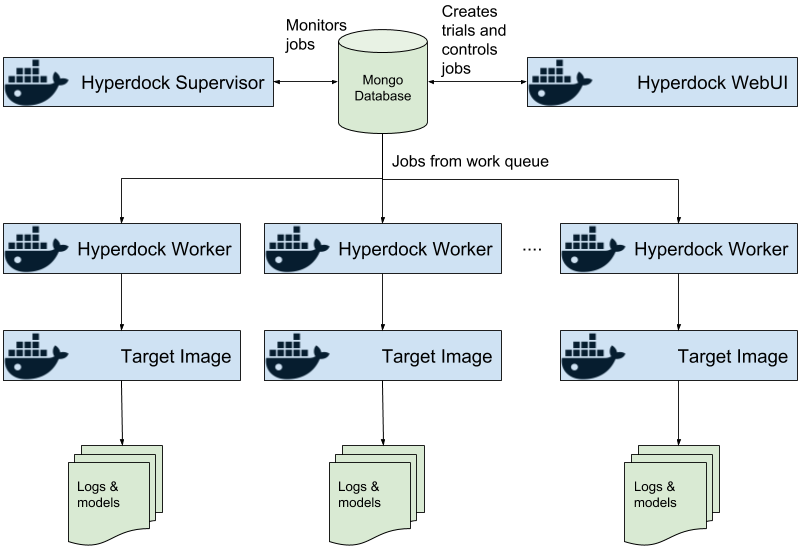

# Hyperdock


[](https://pypi.org/project/hyperdock/)
[](https://hub.docker.com/r/erikgartner/hyperdock-supervisor/)
[](https://travis-ci.org/ErikGartner/hyperdock)
[](https://codecov.io/gh/ErikGartner/hyperdock)

*A simple framework for distributed hyperparameter optimization in Docker.*

## Philosophy

The main idea of Hyperdock is universal hyperparameter optimization that can optimize a target written in any language or using any framework as long as it can be deployed in a Docker image.



From the **Hyperdock WebUI** the user can add **trials** that specify the **target image** and the hyperparameter space.

The **Hyperdock Supervisor** then reads the user-defined trial from the Mongo database and creates sets of parameter combination to be evaluated.
These **jobs** are added to the **work queue**.

The **Hyperdock Workers** dequeues jobs from the work queue and then evaluates the **target image** with these parameters. During this the Hyperdock Supervisor monitors the progress of the jobs and the status of the workers.

The Hyperdock Supervisor, Workers and WebUI need not run on the same host. They only need to be able to access the same Mongo database and the workers need to have access to any data required by the target image.

The **target image** receives the parameters from the json file `/hyperdock/params.json`. Once the target image has evaluated the parameters it simply writes the loss to file `/hyperdock/loss.json` with the option of storing important files to `/hyperdock/out`. Logs from the target image are periodically tailed from the workers to the WebUI.

## Running
Setting up the Hyperdock system can seem a bit complicated but once it is up it quite easy to use.

You can either use the built Docker images for Hyperdock or run the parts directly on the host.

#### Supervisor
To start the Hyperdock Supervisor using the Docker image run the following command:
```bash
docker run -it --rm --name hyperdock-supervisor --link hyperdock-mongo \
  erikgartner/hyperdock-supervisor:latest \
  --mongodb mongodb://hyperdock-mongo:27017/hyperdock
```

Or run it on your host with Python 3.6 and install with pip:
```bash
pip install hyperdock
hyperdock-supervisor --mongodb mongodb://localhost:27017/hyperdock
```

##### Options:
- `--mongo mongodb://localhost:27017/hyperdock` URL to the Mongo database

For full arguments to the supervisor run: `hyperdock-supervisor --help`.

#### Worker
To start the Hyperdock Worker using the Docker image run the following command:
```bash
docker run -it --rm -v /var/run/docker.sock:/var/run/docker.sock \
  --link hyperdock-mongo \
  -v $(pwd):$(pwd) \
  erikgartner/hyperdock-worker:latest \
  --mongodb mongodb://hyperdock-mongo:27017/hyperdock
```

##### Options:

- `-v $(pwd):$(pwd)` mirrors the path structure from the host in to  the Docker container. This is needed since the paths must be the the same when the worker starts the Target Image and mounts the data and results folders.
- `-v /var/run/docker.sock:/var/run/docker.sock` gives the Docker image access to control the outer Docker daemon. This is crucial for worker to start new containers

Or run it on your host with Python 3.6 and install with pip:
```bash
pip install hyperdock
hyperdock-worker --mongodb mongodb://localhost:27017/hyperdock
```

For full arguments to the worker run: `hyperdock-worker --help`.

**Note:** That since the Hyperdock Worker needs to control Docker and access files on the host computer it might be easier to run it directly on the host.

#### WebUI
To start the Hyperdock WebUI using the Docker image run the following command:
```bash
docker run -it --rm --name hyperdock-webui --link hyperdock-mongo \
  -e ROOT_URL=http://localhost:3000/ \
  -e MONGO_URL=mongodb://hyperdock-mongo:27017/hyperdock \
  -p 3000:3000 \
  erikgartner/hyperdock-webui:latest
```

##### Options:

- `-e MONGO_URL=mongodb://hyperdock-mongo:27017/hyperdock` sets the Mongo database
- `-p 3000:3000` publish the port to the host

Or run it on your host with Meteor:
```bash
# Setup Meteor
curl https://install.meteor.com/ | sh # Install Meteor
cd web/
meteor npm install

# Start WebUI
export MONGO_URL=mongodb://localhost:27017/hyperdock
meteor run
```

#### Target Image
For the **Target Image** the following volumes are mounted:

- `/hyperdock/`
  - `loss.json` write the final loss here
  - `params.json` contains the parameters for this run
  - `out/` use this to write any other files to the result folder
- `/data` a read only folder that contains any external data needed

See the [Dockfile template](docker/Dockerfile.template) for an example.

#### Mongo database
To start a Mongo database you can use this simple Docker command or use any normal Mongo instance.
```bash
# Starts mongo db, add --bind_ip_all to listen on all interfaces.
docker run --name hyperdock-mongo -p 27017:27017 -d mongo
```

## Building
If you want to develop Hyperdock it is recommended that you use [Pipenv](https://docs.pipenv.org/) to manage the Python version the package dependencies.

The WebUI is built using [Meteor](https://www.meteor.com/) which needs to be installed prior to development.


## License
Copyright 2018 Erik Gärtner

Licensed under the Apache License, Version 2.0 (the "License");
you may not use this file except in compliance with the License.
You may obtain a copy of the License at

http://www.apache.org/licenses/LICENSE-2.0
